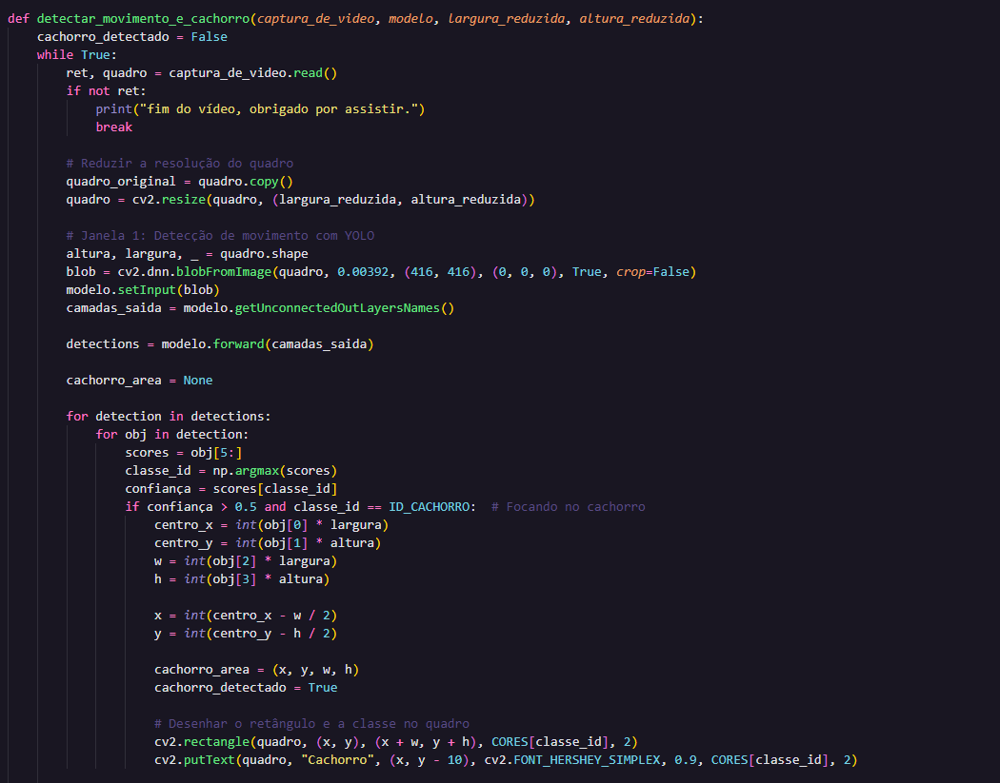
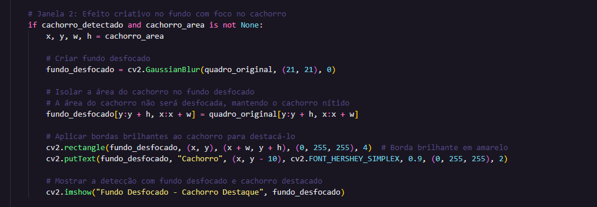

# Projeto de Visão Computacional para Decteção de Movimentos De Animal.
Projeto criado para disciplina Fundamentos de Inteligência Artificial (FIA) - Graduação. Prof. Pablo De Chiaro
Aluno: Artur Nola Moraes Lima

## Descrição do Projeto

Esse projeto utiliza técnicas de visão computacional para detecção de movimentos de um animal em movimento, ele detecta frames por frames do video e indentifica o animal, o projeto em si tem duas "Janelas" um com um foco em Detecção em movimento apenas focando no animal e a outra com um toque em desfoque, focando apenas o animal também.

O projeto está em construção e falta arrumar alguns bugs.

## Função de detectar_movimento_e_cachorro;



## Função de defoque com apenas o foco no animal


## Instalação de Dependências

Certifique-se de que seu ambiente virtual esteja ativado. Instale as dependências listadas no arquivo `requirements.txt`:

```bash
pip install -r requirements.txt
```

### Conteúdo do arquivo `requirements.txt`:

```text
numpy==2.0.0
opencv-python==4.10.0.84
```


## Referências e Leitura

- (Ref) YoloV3: [yolov3](https://pjreddie.com/darknet/yolo/)
- (Leitura) SSD MobileNet: [SSD MobileNetV2](https://arxiv.org/abs/1512.02325)
- (Leitura) SSD MobileNet: [SSD MobileNetV2 Object Detection](https://medium.com/@techmayank2000/object-detection-using-ssd-mobilenetv2-using-tensorflow-api-can-detect-any-single-class-from-31a31bbd0691)
- (Ref) COCO: [Common Objects in Context](https://cocodataset.org/#overview)
